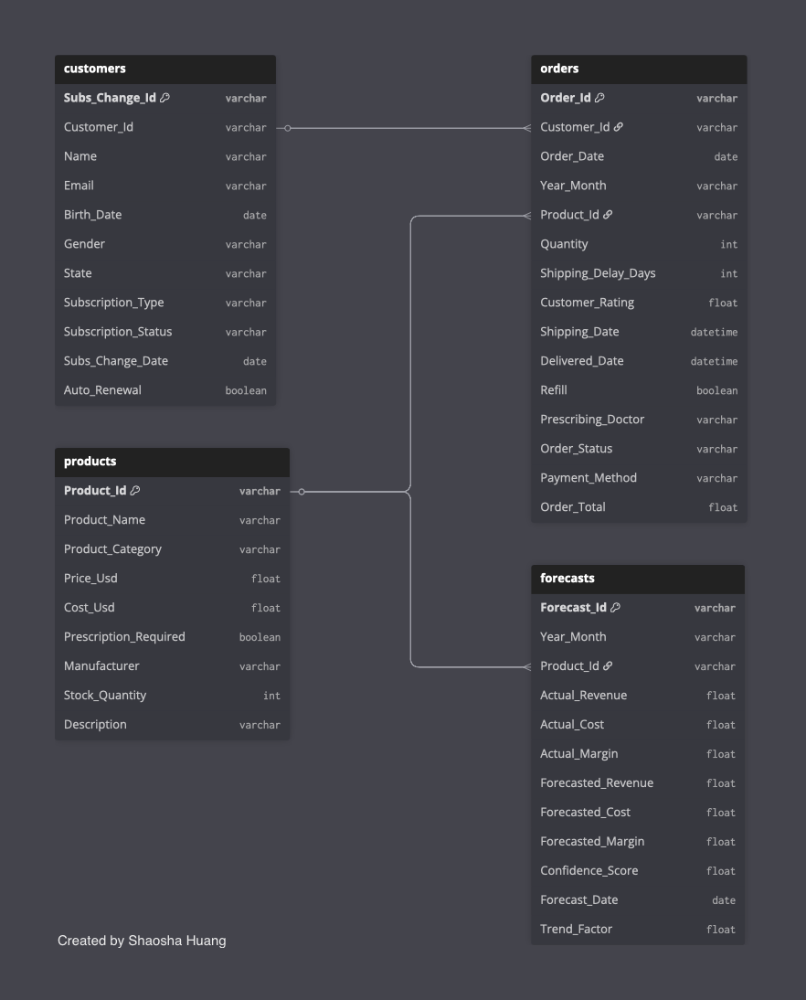

# 🧪💊 Shao's Pharmacy: Data Analytics Project

Welcome to Shao's Pharmacy, a portfolio project demonstrating the full analytics workflow, from synthetic data creation and data pulling with SQL to actionable Tableau dashboards.

## 🚀 Project Overview

This project showcases my ability to generate realistic sample data (Python), extract data (SQL), and build dashboards (Tableau) that drive business value.

The core focus is on **three key dashboards** that answer important business questions in a clear, actionable format:

- **📈 Online Orders Performance Scorecard Dashboard:**  
  Unified view of sales, revenue, costs, forecasts, product performance, and trends.  
  *(This dashboard has been fully built out and included in the repository.)*

The 2 dashboards below are not yet fully implemented, but I provide example Tableau calculations, analysis strategies, and possible business use cases as guidance for future build-out.  

- **👥 Customer Insights & Retention Dashboard:**  
  Segmentation, churn/retention, repeat purchases, subscription lifecycle, and customer journey.

- **🚚 Product Supply Dashboard:**  
  Supply chain health, inventory levels, stockouts, supplier performance, and fulfillment metrics.

## 🏢 Industry Background

**Industry:** Telemedicine / Online Pharmacy  
**Years:** 2020-2025  
**Business Model:** Direct-to-consumer online medication sales, subscriptions, and recurring orders.  
**Metrics:** Order volume, retention, category sales, fulfillment rates, shipping times, satisfaction, revenue forecasts.

## 📚 Data Structure

Four main tables power the analysis:
- **customers:** Demographics and subscriptions
- **products:** Catalog, pricing, prescription status
- **orders:** Transactions and fulfillment details
- **forecast:** Monthly revenue forecasts, actuals, projections, margin, trend factor, confidence score



## 📈 Online Orders Performance Scorecard: Analysis & Value

### Dashboard Overview

The **Online Orders Performance Scorecard (YTD 2025)** provides a clear, actionable summary of Shao's Pharmacy's financial performance across key product categories: Allergy, Hair, Mental Health, Pain Relief, Skincare, and Sleep.

Each section shows:
- **Revenue to Date** and % of goal/progress
- **Gross Margin Trends** (quarterly)
- **Revenue Actual vs. Forecasted** (quarterly)
- **Contribution to Total Revenue**

**Live Tableau Online Orders Performance Scorecard Dashboard:**  
[View the interactive scorecard on Tableau Public](https://public.tableau.com/views/ShaosPharmacy-OnlineOrdersPerformanceScorecard/Scorecard?:language=en-US&:sid=&:redirect=auth&:display_count=n&:origin=viz_share_link)

Or see below:


### Strategic Insights & Business Value

#### 1. **Focus on Top Revenue Drivers**
- **Hair** and **Mental Health** categories contribute over **60% of total revenue** (32.6% Hair, 31.6% Mental Health), making them critical for growth, marketing, and inventory planning.
- High overall progress toward revenue goals (85%+ in all segments; >92% for Mental Health & Sleep) shows strong performance and healthy demand.

#### 2. **Margin Optimization Opportunities**
- **Pain Relief** maintains the highest margins (47%+), but lower revenue share (4.5%). Consider promoting or expanding this category for higher profitability.
- **Mental Health** margins are flat (30%), review cost structures or pricing to improve profitability where possible.
- **Skincare** margins are lower (34%), but growth trends are positive.

#### 3. **Forecast Accuracy & Sales Planning**
- All categories display **quarterly actual vs. forecasted revenue**, enabling teams to assess sales accuracy, seasonality, and set realistic future targets.
- Most categories are meeting or nearing forecast, signaling reliable business planning and opportunity to further refine projections.

#### 4. **Balanced Portfolio Insights**
- **Allergy**, **Skincare**, and **Sleep** offer diversification, contributing a combined ~30% of revenue.
- **Sleep** category, while smaller in revenue (6.4%), has the 2nd highest progress to goal (92.5%), suggesting strong market fit or effective campaigns.

### 🛠️ Team Actions & Dashboard Value

- **Marketing:** Double down on Hair and Mental Health marketing; test new campaigns for Pain Relief and Sleep to boost their share.
- **Product Management:** Prioritize supply for top categories; explore new product sourcing and ways to improve margins in Mental Health and Skincare.
- **Finance:** Use forecast vs. actual insights for more accurate budgeting and resource allocation.
- **Operations:** Monitor inventory for high-performing segments; prepare for seasonal surges based on quarterly trends.

- **Visual Storytelling for Stakeholders:**  
  The dashboard's visual clarity (progress rings, line/bar charts, contribution bar) makes trends and targets instantly understandable—ideal for executive updates, cross-team planning, and investor presentations.

## 👥 Customer Insights & Retention Dashboard

### Dashboard Overview & Analysis Value

This dashboard provides actionable segmentation of customers by value and risk, enabling managers to boost retention, target win-back campaigns, and optimize subscription strategies.  

**Analysis in Tableau:**  
- RFM (Recency, Frequency, Monetary) scoring to identify high-value and at-risk customers
- Churn prediction and retention tracking by product, region, or segment
- Subscription lifecycle analytics and usage trends
- Exportable customer lists for targeted outreach

**Business Value:**  
- Quickly identify top customers for loyalty campaigns and upsell opportunities
- Detect at-risk segments and proactively address churn
- Track trends in customer satisfaction, purchases, and subscriptions

### Segmentation Criteria

Customers are categorized using two main criteria:

- **🌟 High-Value Customers:**  
  Customers meeting these criteria are considered high-value for the business.
  - Top RFM scores: recent, frequent, and high-spending
  - Active or upgraded subscriptions
  - Frequent buyers of high-margin/prescription products
  - Consistent refills, high average order value

- **⚠️ At-Risk Customers:**  
  Customers meeting these criteria are considered at-risk and may require intervention.
  - Low RFM scores: no order in >6 months, declining frequency/spend
  - Paused, canceled, or downgraded subscriptions
  - Complaints, low satisfaction, or multiple cancellations
  - Rising churn signals in segment or region

**Sample Tableau Calculations:**

*Declining Order Frequency:*
```tableau
IF SUM([Recent 6 Months Order Count]) < SUM([Previous 6 Months Order Count]) THEN 'Declining' END
```
*Significant Spend Drop:*
```tableau
IF SUM([Recent 6 Months Spend]) < SUM([Previous 6 Months Spend]) * 0.7 THEN 'Significant Drop' END
```

## 🚚 Product Supply Dashboard

### Dashboard Overview & Analysis Value

This dashboard enables managers to monitor supply chain health and proactively manage risks and inventory, with segmentation by product, category, supplier, and region.  

**Analysis in Tableau:**  
- Inventory alerts and trend analysis by product/category
- Supplier performance evaluation (on-time rate, delays, cancellations)
- Stockout and fulfillment rate tracking
- Exportable lists for procurement or restocking actions

**Business Value:**  
- Minimize stockouts and lost sales by monitoring inventory and fulfillment KPIs
- Improve supplier selection and contract management
- Enable teams to focus restocking efforts where needed most

### Segmentation Criteria

Supply is categorized using two main criteria:

- **✅ Healthy Supply:**  
  Inventory or suppliers meeting these criteria are considered healthy.
  - Inventory levels above forecasted demand
  - High supplier on-time delivery rate
  - Low stockout and cancellation rates

- **🚨 At-Risk Supply:**  
  Inventory or suppliers meeting these criteria are considered at-risk and may require action.
  - Inventory below reorder point
  - Repeated supplier delays/missed deliveries
  - High rate of backorders or supply-related cancellations

**Sample Tableau Calculations:**

*Low Inventory Alert:*
```tableau
IF [Inventory Level] < [Reorder Point] THEN 'Low Inventory' END
```
*Supplier On-Time Delivery Rate:*
```tableau
SUM([On-Time Deliveries]) / SUM([Total Deliveries])
```
*Fulfillment Rate:*
```tableau
SUM([Orders Shipped On Time]) / SUM([Total Orders])
```
*Stockout Rate:*
```tableau
SUM([Orders Canceled Due to Stockout]) / SUM([Total Orders])
```

## 📦 Included Files

Here's what's in the repo and what each file is for:

- **customers.csv, products.csv, orders.csv, forecasts.csv**  
  Synthetic datasets for customers, product catalog, transactions, and monthly forecasts.

- **generate_customers_data.py, generate_products_data.py, generate_orders_data.py, generate_forecasts_data.py**  
  Python scripts to create the above datasets, making refresh and reproducibility easy.

- **etl_all_tables_joined.sql**  
  SQL script to join all tables for analysis and dashboard building if it were direct connection.

- **Diagram_ERD.png**  
  Entity Relationship Diagram showing how the tables connect.

- **Dashboard_Shao’s Pharmacy_Online Orders Performance Scorecard.twbx**  
  Tableau workbook, interactive dashboard with business and financial KPIs and trends.

- **Dashboard_Shao’s Pharmacy_Online Orders Performance Scorecard.png**  
  Static image of the Tableau dashboard for quick review.

---

**This project demonstrates end-to-end technical and business analytics skills—turning data into actionable insights and real-world value.**