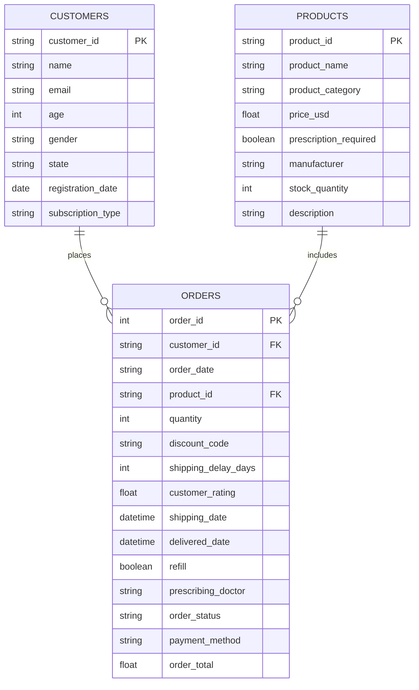

# 📊 Shao's Pharmacy: Data Analytics Project

Welcome to the portfolio repository for **Shao's Pharmacy**, a sample business analytics project.  
This project demonstrates the entire analytics workflow: synthetic data creation, SQL cleaning & analysis, and Tableau dashboarding.

> **Quality over quantity:**  
> Two stellar, business-relevant projects stand out much more than several mediocre ones.

Fork this repo, adapt it, and make it your own.  
**Happy portfolio-ing! 🚀**

---

## 🏢 Project Background

**Industry:** Telemedicine / Online Pharmacy  
**Active Years:** 2019–2024 (5 years of data)  
**Business Model:** Direct-to-consumer online prescription and over-the-counter medication sales, with monthly/yearly subscription options for recurring orders.  
**Key Metrics:** Order volume, customer retention, product category sales, prescription fulfillment rates, shipping times, customer satisfaction.

As a data analyst at Shao's Pharmacy, your goal is to generate actionable insights from sales, customer, and product data to improve growth, retention, and operational efficiency.

---

## 🔎 Key Areas of Insights & Recommendations

Insights and recommendations are provided on the following key areas:
- **Customer Segmentation:** Who are our top segments? How do subscription types affect ordering patterns?
- **Product Performance:** Which products/categories drive revenue? What are seasonal trends?
- **Order Fulfillment & Operations:** Shipping delays, prescription completion rates, and refill behavior.
- **Customer Satisfaction:** Ratings, feedback, and their relationship to repeat business.

- The SQL queries used for initial cleaning and inspection are [here](link).
- Targeted SQL queries for business questions are [here](link).
- The interactive Tableau dashboard is [here](link).

---

## 🗄️ Data Structure & Initial Checks

Shao's Pharmacy's database consists of **three main tables** with a total of **X** records.  
Here’s a description of each table:

- **customers:** Demographic and subscription info for each customer.
- **products:** Product catalog, pricing, and prescription status.
- **orders:** Transactional table linking customers and products, with order details and fulfillment info.

### Entity Relationship Diagram

Below is the ERD in Mermaid format.  
**Tip:** GitHub now natively renders Mermaid diagrams in Markdown preview. If you view locally, VS Code with a Mermaid extension will also work.

**Note:**  
If column names are showing up cut off in your repo, it's likely because of line length or the Mermaid renderer.  
- Try placing each column on its own line, as above.
- Ensure there are no trailing spaces or tabs.
- If you still see truncation, consider using a PNG image export of the ERD for a flawless display.

---

## 📝 Executive Summary

### **Overview of Findings**

Over five years, Shao's Pharmacy grew steadily, with monthly subscriptions increasing customer retention.  
Hair and mental health products accounted for the majority of sales, while shipping delays and prescription issues were key drivers of lower ratings.  
Targeting high-value segments and optimizing fulfillment are critical opportunities.

[Dashboard snapshot or key trends visualization here]

---

## 🔬 Insights Deep Dive

### **Customer Segmentation**
- **Insight 1:** Monthly subscribers place 2.5x more orders per year than one-time buyers.
- **Insight 2:** Customers aged 25–40 are most likely to refill prescriptions and upgrade to yearly plans.
- **Insight 3:** CA, NY, and TX represent over 50% of total customer base.
- **Insight 4:** Subscription upgrades peak every January and July.

[Customer segmentation visualization]

---

### **Product Performance**
- **Insight 1:** Minoxidil and Sertraline are top-selling items, with seasonal spikes in spring and fall.
- **Insight 2:** Prescription-required products drive 70% of revenue.
- **Insight 3:** OTC products have lower customer ratings but higher repeat purchase rates.
- **Insight 4:** Manufacturer discounts correlate with order volume surges.

[Product sales visualization]

---

### **Order Fulfillment & Operations**
- **Insight 1:** Average shipping delay dropped from 12 days (2019) to 6 days (2024).
- **Insight 2:** 8% of orders experience prescription verification delays.
- **Insight 3:** Refills account for 30% of annual order volume.
- **Insight 4:** Most cancellations are concentrated among orders placed on weekends.

[Fulfillment visualization]

---

### **Customer Satisfaction**
- **Insight 1:** 5-star ratings are highest among yearly subscribers.
- **Insight 2:** Lower ratings correlate with shipping delays over 10 days.
- **Insight 3:** N/A doctor names in orders are associated with OTC products and lower ratings.
- **Insight 4:** Customers who give a rating are 40% more likely to place a second order.

[Satisfaction visualization]

---

## 💡 Recommendations

_Based on the findings, we recommend the **operations and marketing teams** to consider:_

- **Optimize shipping workflows,** focusing on high-delay regions (NY, FL, TX).
- **Develop targeted upsell campaigns** for monthly subscribers approaching renewal.
- **Partner with top manufacturers** to secure more product discounts.
- **Improve prescription verification systems** to reduce delays and cancellations.
- **Leverage high-satisfaction customer segments** for referral incentives and testimonials.

---

## ⚠️ Assumptions and Caveats

- **Assumption 1:** All customer state codes are valid US states.
- **Assumption 2:** Doctor names for prescription orders may be unformatted and require SQL cleaning.
- **Assumption 3:** Some fields (e.g., email, manufacturer) are synthetically generated and not real.
- **Assumption 4:** Data for certain months may be sparser due to simulated business cycles.

---